# Hotel-Reservation-System-in-Java-using-Applet
Java Swing-based Hotel Reservation System with UCanAccess database. Users can register, login, book rooms, view details, and submit feedback. Admins manage rooms, employees, view customer info, and handle feedback. Features include room booking, employee management, and secure payments for efficient hotel operations.

## Features
- **User Functionality:**
  - Register and create an account.
  - Secure login for users.
  - Browse available rooms and view detailed room features.
  - Book rooms with options for check-in/check-out dates.
  - Submit feedback regarding their stay.
  - Update personal profile information.

- **Admin Functionality:**
  - Admin login with secure authentication.
  - Add, update, and delete room details.
  - Manage employee records.
  - View customer details and feedback.
  - Oversee room availability and services.

- **General:**
  - Secure payment processing with card details.
  - Real-time updates to room availability.
  - User-friendly interface with intuitive navigation.
  - Data validation and error handling to ensure data integrity.

## Technologies Used
- **Programming Language:** Java
- **GUI Framework:** Swing
- **Database:** Microsoft Access (Managed via UCanAccess JDBC)
- **Libraries:**
  - `net.proteanit.sql.DbUtils` for handling ResultSet to JTable conversion.

## Screenshots

**Welcome Page**

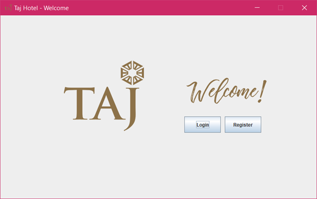

**Registration Page**

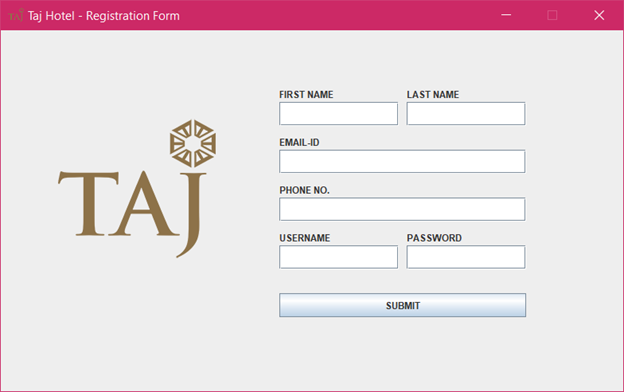

**Home Page**

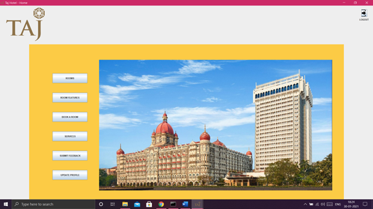

**Rooms Page**

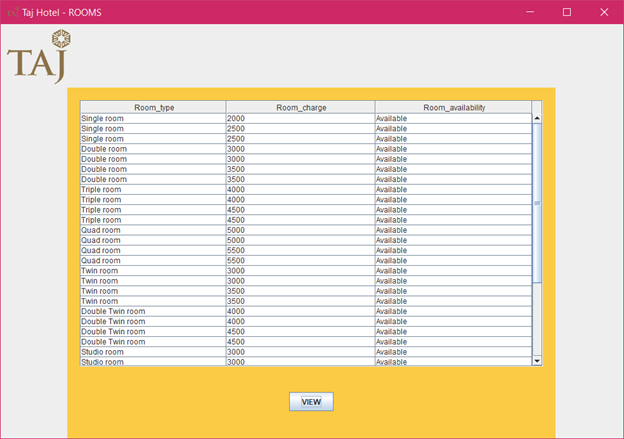

**Rooms Page**

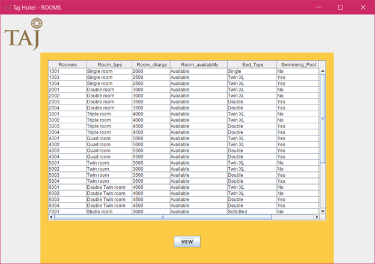

**Room Booking Page**

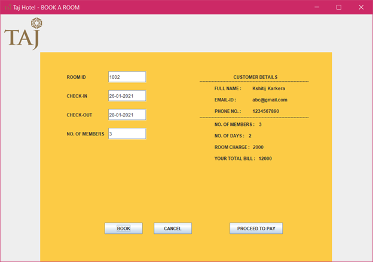

**Proceed to Pay Page**

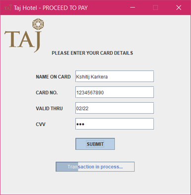

**Services Page**

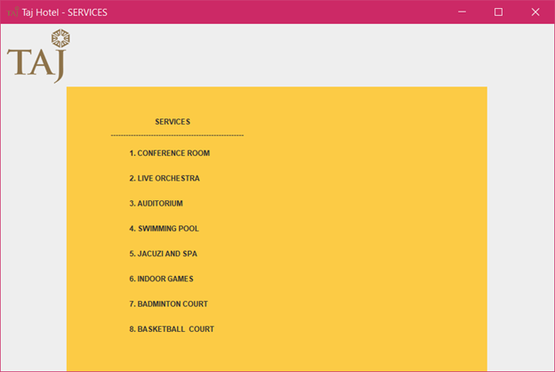

**Feedback Page**

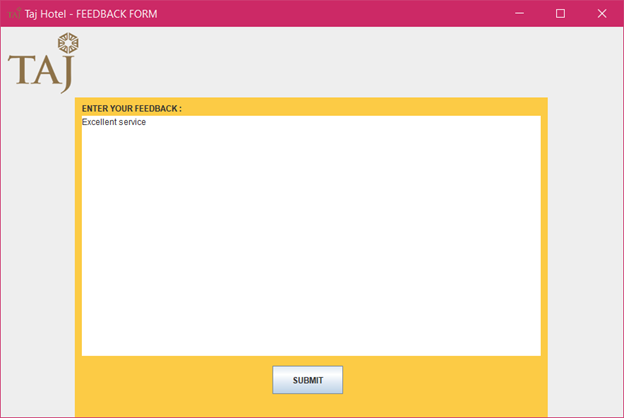

**Update Profile Page**

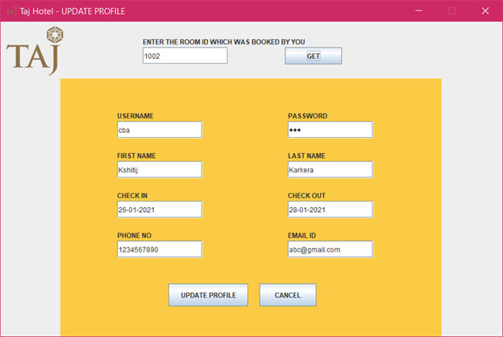

**Admin Home Page**

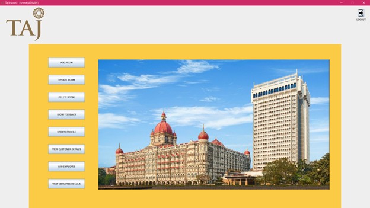

**Add Room Page**

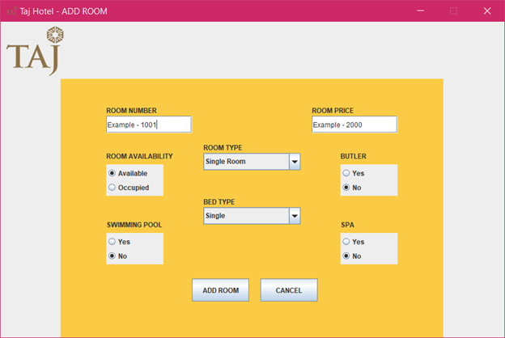

**Update Room Page**

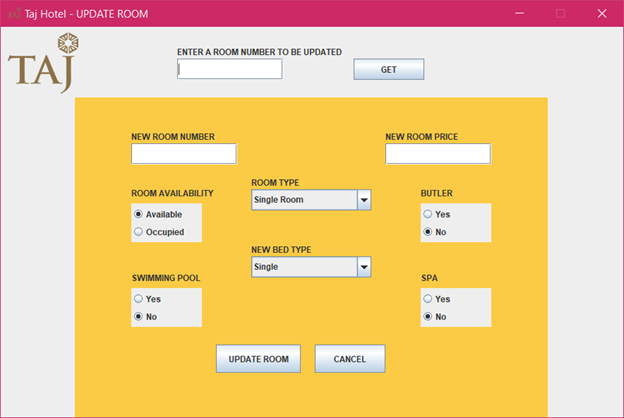

**Delete Room Page**

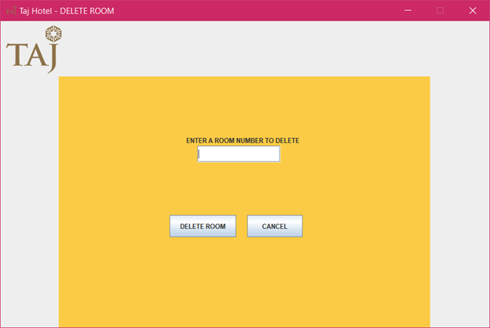

**Customer Details Page**

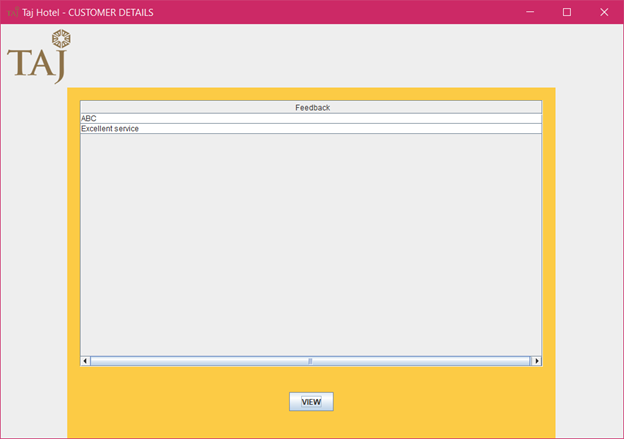

**Update Customer Details Page**

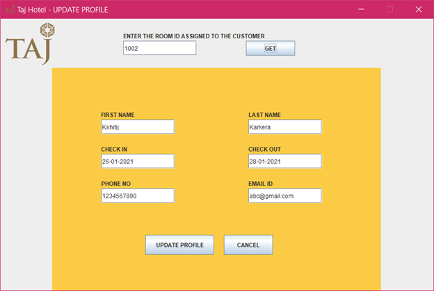

**List Customer Details Page**

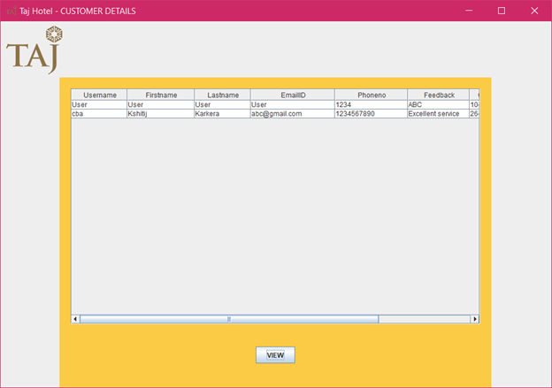

**Add Employee Page**

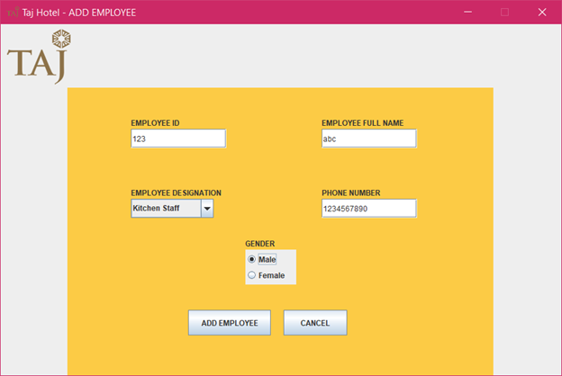

**Employee Details Page**

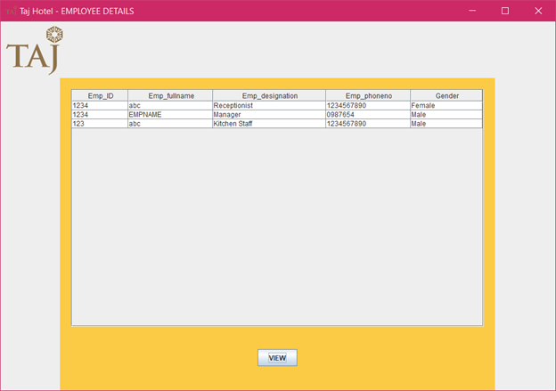
